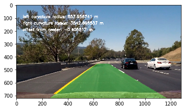

## Advanced Lane Finding

My submission for term 1 project 4, see [advanced_lane_lines.ipynb](./advanced_lane_lines.ipynb) for implementation and [writeup.md](./writeup.md) for details. See [output_video.mp4](./output_video.mp4) for the final pipeline results on the project video.

In this project, your goal is to write a software pipeline to identify the lane boundaries in a video, but the main output or product we want you to create is a detailed writeup of the project.

